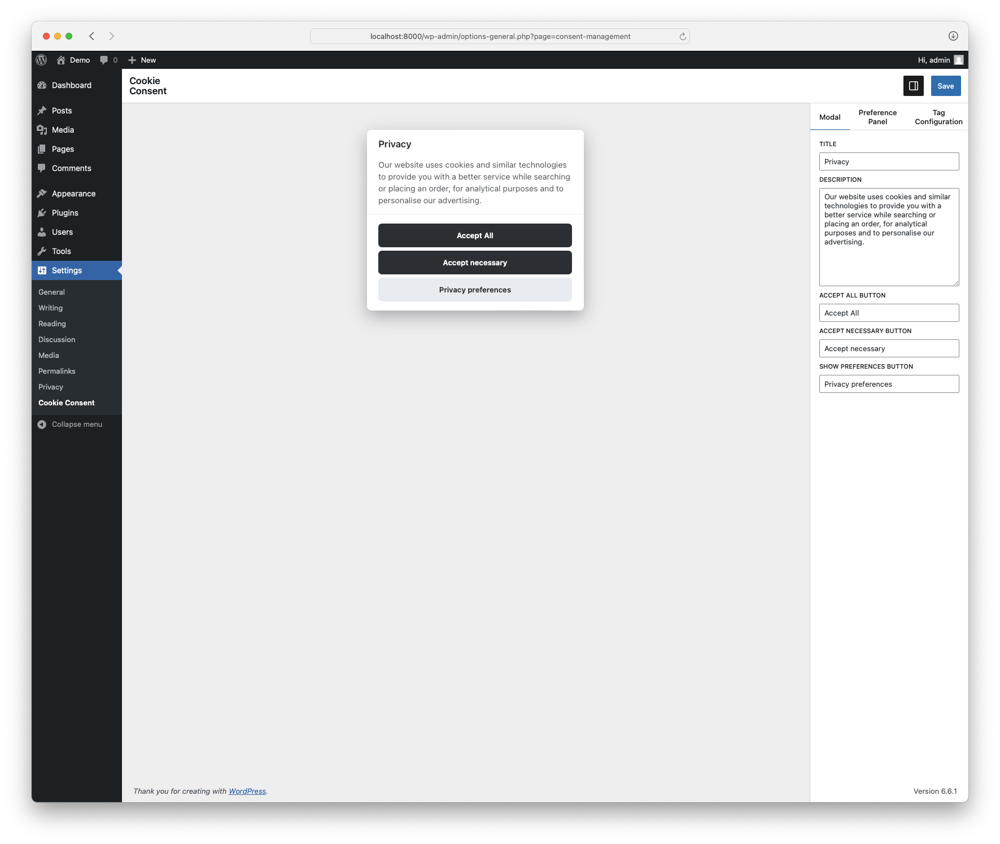
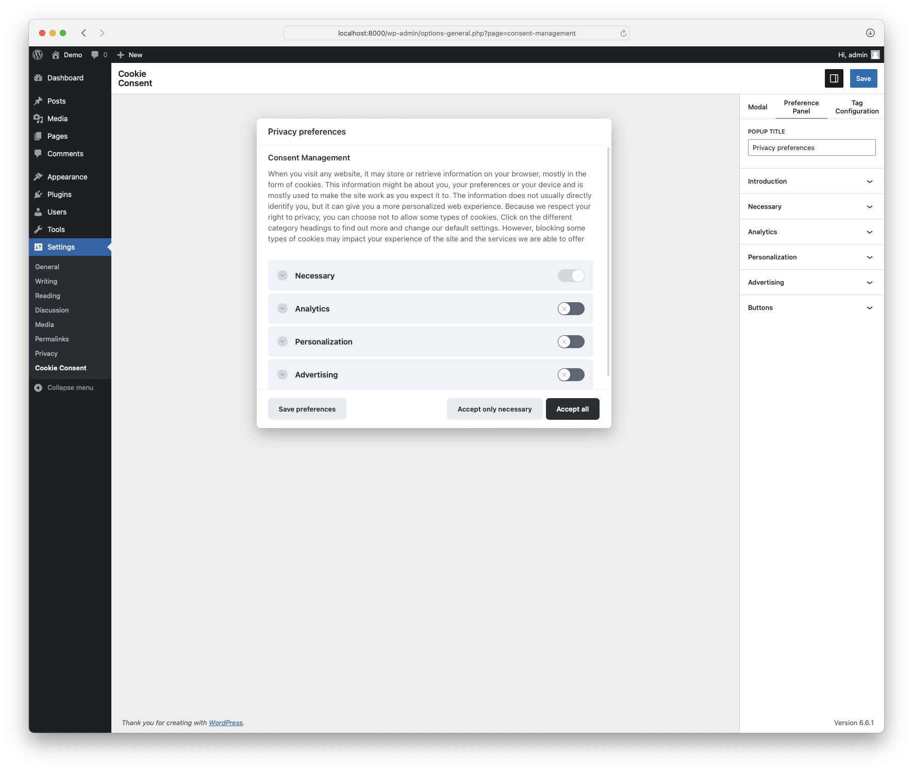
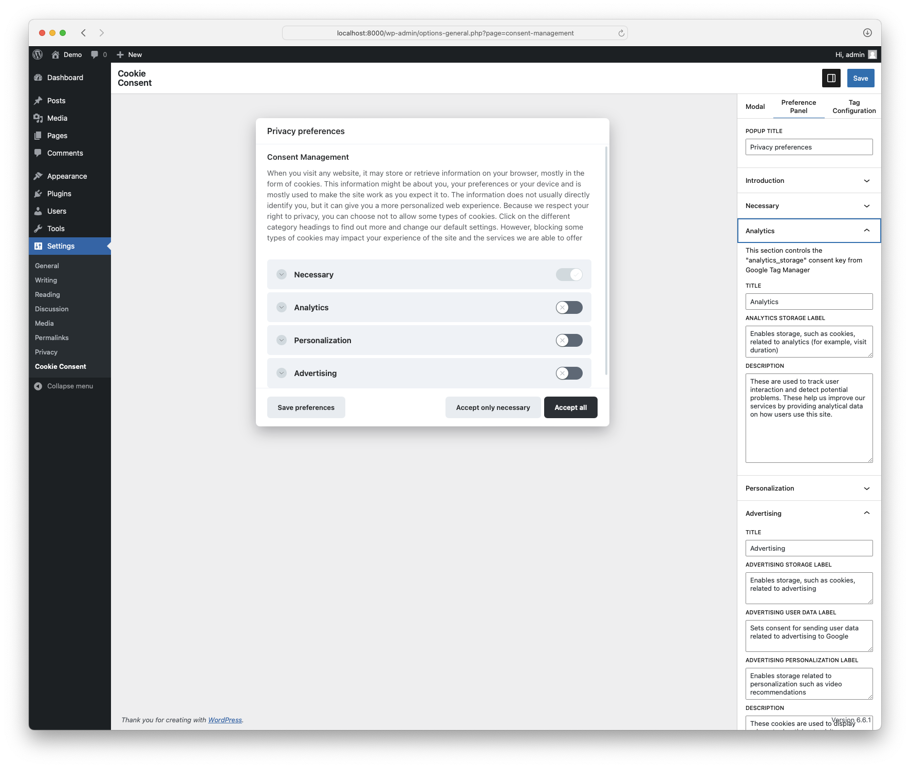
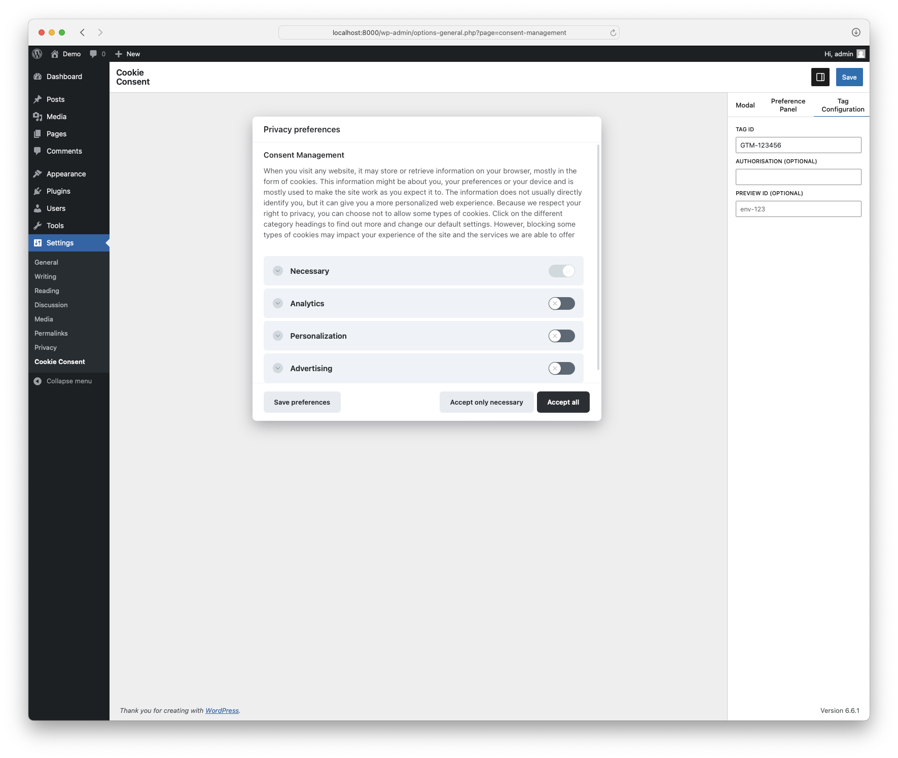
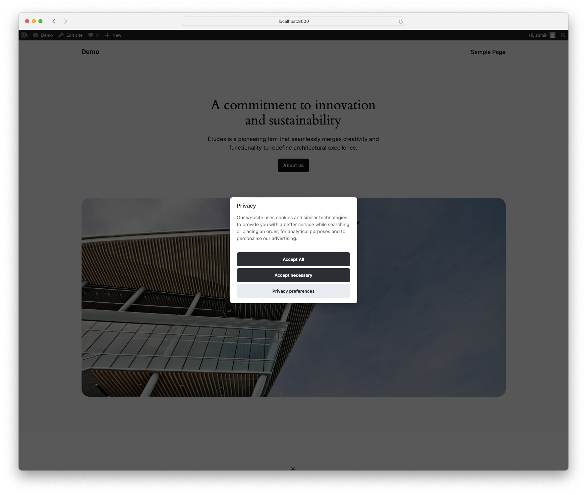

# Consent Management

A WordPress plugin to provide an interface for providing cookie consent
that integrates with [Google Tag Manager Consent Mode](https://support.google.com/tagmanager/answer/10718549?hl=en).

Provides a fully customisable experience for editors to setup the relevant labels and text for configuring Google Tag Manager consents, and inserts the relevant tag manager code to the page. 

Based on [Vanilla Cookie Consent](https://github.com/orestbida/cookieconsent), the interface is ready
for you to apply your customisations. To customise the look feel, see the file at `./sample/style.scss` or follow the docs from Cookie Consent to add CSS.

## To Do

- [] Allow UI shape/style customisation (ie change from popup to banner etc)
- [] Allow colour/style specification from within the admin interface. (at the moment a user-provided CSS sheet must be included to modify the deafult style).
- [] Allow for further customistaion 

---

Please do not submit any Pull Requests here. They will be closed.
Please submit your PR here instead: https://github.com/boxuk/wp-packages

This repository is what we call a "subtree split": a read-only subset of that main repository.
We're looking forward to your PR there!
